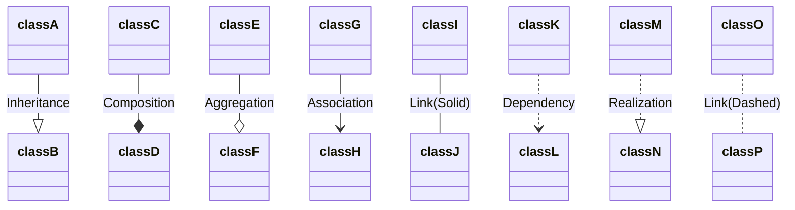
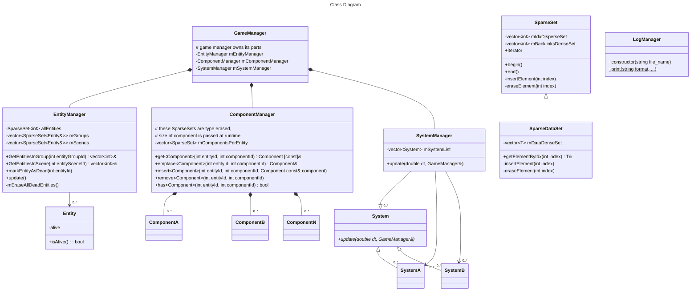

## Indice

- [Estructura de la solución y proyectos (y repositorios de Git)](#estructura-de-la-solución-y-proyectos-(y-repositorios-de-git))
	- [Librerías a usar](#librerías-a-usar)
		- [Ogre3D](#ogre3d)
		- [SDL2](#sdl2)
		- [Fmod](#fmod)
	- [Interfaz de comunicación con el juego desde el motor](#interfaz-de-comunicación-con-el-juego-desde-el-motor)
		- [Flujo de control Motor-Juego](#flujo-de-control-motor-juego)
	- [Uso de métodos del motor desde el juego](#uso-de-métodos-del-motor-desde-el-juego)
- [Estructura de las clases](#estructura-de-las-clases)
	- [Leyenda de los diagramas](#leyenda-de-los-diagramas)
		- [Sintáxis](#sintáxis)
			- [Prefijos](#prefijos)
			- [Sufijos](#sufijos)
			- [Relaciones](#relaciones)
	- [RAII](#raii)
		- [Aplicación de RAII](#aplicación-de-raii)
		- [Finalidad](#finalidad)
	- [Clases Importantes](#clases-importantes)
		- [EntityManager](#entitymanager)
		- [ComponentManager](#componentmanager)
		- [Componentes](#componentes)
		- [LogManager](#logmanager)
	- [Colisiones](#colisiones)
- [Estructura de componentes del motor y juegos](#estructura-de-componentes-del-motor-y-juegos)
	- [Arquitectura Escogida: ECS](#arquitectura-escogida-ecs)
	- [Implementación](#implementación)
	- [Componentes Base del Motor](#componentes-base-del-motor)
		- [Representation2D](#representation2d)
			- [Implementación](#implementación-2)
		- [Representacion3D](#representation3d)
	- [Sistemas Base del Motor](#sistemas-base-del-motor)
		- [CollisionSystem](#collisionsystem)
		- [Render2DSystem](#render2dsystem)
		- [Render3Dsystem](#render3dsystem)
- [Pipeline de generación de contenido](#pipeline-de-generación-de-contenido)

# Estructura de la solución y proyectos (y repositorios de Git) 
## Estructura de la solución en local:
- src
	- Engine
 		- Engine Project
   		- Engine files 0...N
   	- Game1
   		- Game1 Project
   	 	- Game1 files 0...N
   	- Game2
   		- Game2 Project
   	 	- Game2 files 0...N
- assets
- tmp
	- lib
 		- librerias necesarias para compilar la engine
	- bin
   		- ejecutables motor ... (Debug & Release)
     	- dll juego ... (Debug & Release)
      	- assets (cmake hace una copia de los que estan subidos al repo)
  
## Estructura de la solución por repositorios:
- src
	- project
 	- files 0..N
- assets
- Cmake.txt


La compilación y generación de ejecutables de este proyecto estará controlada por un fichero "CMakeLists.txt".

## Librerías a usar
### Ogre3D
Usaremos ogre 3D para representar objetos 2D y 3D en el viewport. Y usaremos las AABBs que nos facilita para comprobar colisiones.
### SDL2
Usaremos SDL2 para manejar el input de teclado y ratón.
### Fmod
Usaremos Fmod para efectos de sonido y música.
### Lua + Sol3
Usaremos Lua para crear la escena y describir los objetos y componentes en su interior. Los scripts de LUA serán capaces de llamar a entidades de cpp.

- **Iteración rápida:** Modificar la disposición del nivel sin recompilar C++.
- **Generación procedural:** Uso de bucles y condicionales simples en la carga (ej: crear 100 árboles en fila con un bucle `for` en lugar de definir 100 líneas de texto).
- **Binding sencillo:** Sol3 expondrá factorías de entidades de C++ a Lua (ej: `createEntity("Enemy")`).

#### Llamar funciones de cpp en LUA
Primero necesitaremos incluir las dependencias para trabajar con lua
```cpp
extern "C"
{
#include "lua/lua.h" //https://www.lua.org/source/5.3/lua.h.html
#include "lua/lualib.h" //https://www.lua.org/source/5.3/lualib.h.html
#include "lua/lauxlib.h" //https://www.lua.org/source/5.4/lauxlib.h.html
}
```

Después querremos las funciones con las que comunicarnos con LUA, estas serán:
```cpp
int addEntity(lua_State* L){
	//createNewEntity devuelve el id de la nueva entidad creada
	//Le pasamos el id de la entidad a lua
	lua_pushnumber(L, EntityManager->createNewEntity());
	//devuelve el número de valores devueltos
	return 1;
}

//recibe como argumento el ID de una entidad, el string con el nombre del componente, y el resto de argumentos son los parametros del constructor del componente
int addComponent(lua_State* L){
	//Cogemos el segundo argumento que LUA le haya pasado a esta función
	string componentName = lua_tostring(L,2);
	auto componentID = EntityManager->componentMap.find(componentName);
	if(componentID==EntityManager->componentMap.end()){
		throw "Component " +componentName+" Not found";
	}
	//Cogemos el primer argumento que LUA le haya pasado a esta función
	string entityId = lua_tointeger(L,1);
	//lua_gettop() da el número de parametros q tiene esta función
	int number_of_parameters = (lua_gettop(L)-2);
	//componentParameters es una lista de punteros a void pero con los argumentos con el tipo correspondiente
	void** componentParameters = malloc(sizeof(void*)*number_of_parameters);
	
	for(int i = 2; i < 2+number_of_parameters; ++i){
		switch(lua_type(L,i)){
			case LUA_TBOOLEAN:
				componentParameters[i-2] = new bool(lua_tobool(L,i));
			break;
			case LUA_TNUMBER:
				componentParameters[i-2] = new double(lua_tointeger(L,i));
			break;
			case LUA_TSTRING:
				componentParameters[i-2] = new double(lua_tostring(L,i));
				break;
		}
	}
	createAndAttachNewComponent(entityId, componentId, componentParameters);
	for(int i = 0; i < number_of_parameters; ++i){
		delete componentParameters[i];
	}
	free(componentParameters);
	return 0;
}
```

Después en el main:
```cpp
int main(){
	const char file[]="script.txt";
	lua_State *L=lua_open();
    luaL_openlibs(L);
	lua_register(L,"addEntity", addEntity);
	lua_register(L,"addComponent", addComponent);
	int s=loaL_loadfile(L,file);
	if(s==0)
   	{
      //Ejecución del archivo
      s=lua_pcall(L, 0, LUA_MULTRET, 0);
   	}
    lua_close(L);
   	cin.get();
   	return 0;
}
```

De forma que luego en el archivo de LUA podríamos usarlo así:
```lua
for i=0,10,1 do 
	ent = addEntity();
	addComponent(ent, "tasy_node", 0,0,0);
	addComponent(ent, "tasy_node_name", "cube_mesh", true);
end
```

## Interfaz de comunicación con el juego desde el motor
La clase principal del juego deberá heredar de la clase abstracta **MotorProgram**.
Esta clase definirá los metodos initGame(), updateGame() y exitGame().
El motor llamará a estos métodos. Como se puede ver en el siguiente gráfico.

### Flujo de control Motor-Juego 

```txt
        |------------------------------------------> Time
        |
Game    |    1----2    3----o----4    5----6
        |    |    |    |         |    |    |
        |----|----|----|---------|----|----|------->
        |    |    |    |         |    |    |
Engine  0----1    2----3      <--4----5    6-------x
        |
        |------------------------------------------>

0: Main
    CONTROL: Engine
    Engine Initialization.

1: Game Main
    CONTROL: Engine to Game
    Gameplay Initialization.
	Función Asociada: initGame()

2: Engine Loop Start
    CONTROL: Game to Engine
    Stuff that needs to be done
    each frame before giving control
    back to game.

3: Game Loop Start
    CONTROL: Engine to Game
    Our game Gameplay Loop
    Includes doing things in/with
    SYSTEMS.
	Función Asociada: updateGame()

4: Game Loop End
    CONTROL: Game to Engine
    The game loop update function
    is DONE.
    Engine may do stuff about the frame,
    for example, clear temporary data.
    Here if the game has not signaled
    that it wants to EXIT, control goes
    back to the Engine Loop Start (2).
    If the game has signaled EXIT,
    control goes to Engine Shutdown (5).

5: Game Shutdown
    CONTROL: Engine to Game
    The game is exiting.
    Do any game-specific shutdown stuff,
    like saving game data.
	Función Asociada: exitGame()

6: Engine Shutdown
    CONTROL: Game to Engine
    The engine is exiting.
    Do any engine-specific shutdown stuff,
    like freeing engine resources.
```

## Uso de métodos del motor desde el juego
Cada uno de los métodos anteriormente mencionados (initGame(), updateGame() y exitGame()) recibirá como argumento un puntero o una referencia a un struct que contengan punteros a todas las funciones del motor que serán públicas. Esta estructura se llamará GameContext. De forma que desde las siguientes funciones se puede acceder a cualquiera de los métodos expuestos del motor con una sintaxis similar a esta: 
```cpp
gameContextRef->getEntitiesWithComponent(X)
```

## Creación de componentes desde el juego
Para crear un componente para el juego se tienen que dar los siguientes pasos:
- **1.** Crear un .hpp que contenga la definición de un struct, con los atributos del componente. Este fichero contiene un atributo que es el string que buscaremos en pasos posteriores para identificar este componente.
- **2.** En el archivo de la escena de LUA leemos cada entidad y comprobamos los atributos que contienen. Dichos atributos deberían coincidir con el string de los distintos componentes existentes. En caso de encontrar alguno en el que esto no sea así lanzaremos una excepción. Cada vez que se lea un componente completo sin errores se añadirá a la lista de componentes en ejecución del juego en cpp.

## Creación de sistemas desde el juego
En ningún momento el juego podrá crear sistemas. Ni tener acceso directo a los sistemas del motor.

Se dota al juego de la función updateGame(). Es responsabilidad de quien programe los juegos en el motor decidir como va a programar el juego, teniendo en cuenta que los componentes no pueden tener lógica.

Se recomienda que al hacer el juego el usuario defina sus propios sistemas independientes a los del juego y que así decida el orden y cuando los llama. Pero se deja la libertad desde el motor de usar cualquier otro paradigma de programación compatible.

## Input
La gestión de entrada se realizará mediante un wrapper sobre **SDL2**. El sistema almacenará el estado de los dispositivos (teclado y ratón) del frame actual y del frame anterior para poder detectar transiciones (pulsaciones nuevas "down", liberaciones "up" y movimiento en caso del ratón).

### Implementación interna
El `InputManager` mantendrá dos copias de los estados: `CurrentState` y `LastState`. Al inicio de cada frame (antes de procesar la lógica del juego), se copiará el estado actual al estado anterior y se sondeará a SDL para actualizar el estado actual.

#### Teclado
SDL proporciona el estado de todo el teclado mediante `SDL_GetKeyboardState`. Usaremos `SDL_Scancode` (posición física) para indexar un array de tamaño fijo `SDL_NUM_SCANCODES` (512).

**Justificación: Scancode vs Keycode**
Se elige `SDL_Scancode` frente a `SDL_Keycode` por dos motivos principales:
1.  **Independencia del Layout (Layout Agnostic):** El Scancode referencia la ubicación física de la tecla en el hardware, independientemente del idioma configurado en el sistema operativo. Esto garantiza que los controles estándar de movimiento (como **WASD**) mantengan la misma posición ergonómica para el jugador, incluso si utiliza un teclado con distribución AZERTY o Dvorak.
2.  **Acceso Directo a Memoria:** La función `SDL_GetKeyboardState` devuelve un puntero a un array interno de SDL indexado nativamente por Scancodes. Usar Keycodes (que representan el carácter 'A', 'B', etc.) requeriría realizar una conversión o "mapeo" adicional en cada consulta, añadiendo una sobrecarga innecesaria.

#### Ratón
Para el ratón gestionaremos dos tipos de datos:
1.  **Botones:** Un array de 5 booleanos/enteros (Izquierdo, Central, Derecho, X1, X2).
2.  **Posición:** Un par de coordenadas (X, Y) para saber dónde está el cursor y cuánto se ha movido (Delta).

### Estructura de Datos
La clase `InputManager` contendrá:
```cpp
// Teclado
std::array<Uint8, SDL_NUM_SCANCODES> kbState;      // Estado actual
std::array<Uint8, SDL_NUM_SCANCODES> kbLastBState;  // Estado frame anterior

// Ratón
std::array<Uint8, 5> mouseButtons;         // Estado actual botones
std::array<Uint8, 5> mouseLastButtons;     // Estado frame anterior botones
Vector2 mousePos;                          // Posición actual (X,Y)
Vector2 mouseLastPos;                      // Posición frame anterior (X,Y)
```
Aclaraciones: El Uint8 devuelto es 1 es pulsado y 0 es no pulsado. Y tamaño 5 de raton lo pusimos para soportar los botones estándar: Izquierdo, Central, Derecho, y los botones laterales X1 y X2 (comunes en ratones gaming).

# Estructura de las clases 

Documentación de Mermaid para construir los gráficos: 
	https://mermaid.js.org/syntax/classDiagram.html
---
## Leyenda de los diagramas
### Sintáxis
"*function() \: returnType*"

#### Prefijos
- \+ Public
- \- Private
- \# Protected

#### Sufijos
- \$ Static
- \* Abstract (Cursiva)

#### Relaciones

---



## RAII
Todas nuestras clases usarán la técnica de programación RAII: https://en.cppreference.com/w/cpp/language/raii.html.

### Aplicación de RAII
- Encapsular cada recurso en una clase, donde:
	- el constructor reserva el recurso y se asegura de instaurar todos los invariantes de representación o lanzar una excepción si esto es imposible
	- el destructor libera el recurso y nunca lanzará excepciones
- Siempre usar el recurso via una instancia de una clase que aplique RAII y que cumpla una de estas dos:
	- Tiene tiempo automatico de almacenamiento o tiempo de vida finito.
	- Tiene un tiempo de vida confinado por un objeto automático o de vida finita

Esto implica que aquellas clases que requieran reservar memoria para funcionar se ocuparan de liberarla automáticamente en su destrucción.
Es decir, el tiempo de vida de un recurso será menor o igual al tiempo de vida del objeto que lo contiene.

### Finalidad
El uso de RAII pretende conseguir:
- Que no haya memory leaks
- Que no pueda haber acceso a regiones de memoria sin inicializar o con basura

## Clases Importantes

### SystemInterface
Implementa: 
- initSystem() 
- updateSystem()
- destroySystem()
Todos los sistemas tanto del motor como de los juegos heredan de esta clase base.

### EntityManager
- Contiene la lista (SparseSet) con todas las entidades vivas.
- Todas las entidades que contiene serán siempre validas

### ComponentManager
- Contiene una lista por tipo de componente posible
- La misma posición de distintas listas de componentes serán componentes pertenecientes a la misma entidad. Esta posición además coincidirá con la posición de la entidad en la lista de entidades del EntityManager
- Las listas de componentes

### LogManager
- Todos los mensajes sacados por el motor o por el juego serán producidos por una instancia de esta clase
- Los mensajes serán reflejados en un fichero .log contenido en la carpeta logs del proyecto.
- Todos los mensajes impresos con esta clase llevarán hora, minutos y segundos desde que se inició el programa. Y se imprimirán en el orden en el que se hacen las llamadas al LogManager
- Usa la sintaxis del printf de c
- Se instancia al inicio con el motor, y se cierra con el motor
- Acceso al metodo print estatico de esta clase para que pueda escribir quien sea

## Colisiones
- Cuando hay colisión entre dos entidades se añade un componente (CollisionComponent) a cada una (si no lo tienen ya). En este componente hay un buffer de tamaño fijo que almacena los indices de los otros objetos contra los que se ha chocado en este frame. Al final de cada frame este componente se eliminará de todos los objetos que lo tengan
- A la hora de crear el juego se podrán consultar las colisiones de una entidad con getEntityCollisions(int entityId), que devolverá una lista de indices.
  
# **Estructura de componentes del motor y juegos**

## Arquitectura Escogida: ECS
Usaremos como base para nuestra arquitectura el modelo Entity Componente System o ECS.

Esta arquitectura tiene 3 componentes básicos:
- **Entidades**: la entidad es la unidad minima de existencia de nuestro juego. Para que algo exista, se renderice o pueda tener parametros asociados habrá de ser una entidad. 
Las entidades no albergan ningún tipo de información en su interior. Pero cada una tiene asignado un identificador implicito gracias a su representación con un SparseSet como se explicará más adelante.
- **Componentes**: contienen unicamente datos serializables y públicos. Es decir, no podrán contener referencias ni punteros. En caso de necesitar un array de datos tendrán un buffer de tamaño constante autocontenido dentro del componente. 
No podrán tener lógica, ni requerir información de otras instancias del mismo componente o de otros distintos. La única manera en la que podrán contener funciones o métodos es cuando estos sean atómicos (se modifican a si mismos para conservar los invariantes de representación) u obtengan infomación implicita en el componente.
Su tamaño debería ser el menor posible.
Cada entidad solo puede tener asociado un componente de cada tipo
- **Sistemas**: contenedores de toda la lógica del juego. No podrán hacer llamadas a otros sistemas, pero si podrán obtener información así como modificarla de los componentes de cualquier entidad existente.
Todos los sistemas llaman a su método initSystem() al crearse, después una vez por bucle de juego llamaran a updateSystem() y por último al finalizar la ejecución del problema llamaran a destroySystem(). 
Los sistemas tienen una flag active. El método update hará return en la primera linea sin hacer nada si esa flag no está activa, es decir si el sistema no está activo.
Una única instancia de cada sistema es creada y gestionada por el system manager. La memoría para todos los sistemas se reserva al comienzo de la ejecución y no se liberará hasta que no se cierre el juego.
El juego no podrá interactuar con los sistemas del motor de manera directa ni crear los suyos propios.

## Implementación
Usaremos extensivamente SparseSet para representar entidades, componentes y grupos de entidades.
Se puede ver una explicación detallada de SparseSet [aquí](anexos/SparseSet.md).

## Componentes Base del Motor

### Transform2D
Almacena la posición y escala de la entidad como un `Vector2<float>`, y la rotación como un `float` representando el ángulo en radianes a partir del `Vector2(1,0)`, en sentido antihorario.

### Orientation
Quaternion que almacena la orientación de un objeto.

### Scale
Vector 3 que almacena la escala en los ejes "xyz" del objeto

### tasy_node
Almacena en un vector3 de floats (4 bytes) la posición del objeto y en un un entero de 4 bytes el índice del nodo de ogre que tiene asignado.
Por lo tanto al añadir el componente tasy_node a un elemento de la escena se genera también un nodo de ogre vinculado a él. Y al quitarselo se elimina consigo el nodo de ogre.

### tasy_nodeName
Almacena en como mucho 8 caracteres el nombre de la malla asignada.

### Graphics2D
Almacena un textureId. Un textureId será un entero asignado en tiempo de ejecución.

Tiene un flag de un bit que indica si se dibuja en el viewport antes o después de los objetos 3D.

### Graphics3D
Almacena un meshId como `string`. El componente actúa como interfaz para realizar la representación de un mesh mediante OGRE, cuyo nodo será almacenado en un `SparseSet` aparte.

### BoxCollider
Proporciona un ortoedro sobre el cual podrán darse colisiones con otros elementos que también posean un `BoxCollider`. Este será equivalente a una BoundingBox de OGRE. Una colisión entre dos elementos dados será registrada al principio del bucle del juego, y almacenada en sus partícipes durante esa misma iteración mediante un componente `CollisionData`.

### CollisionData
Almacena la información de una colisión que haya ocurrido en la misma iteración del bucle del juego. Este componente será añadido automáticamente por el motor a medida que sucedan los contactos entre colliders, y no deberá ser añadido manualmente. Una vez acaba la iteración del bucle, este componente es eliminado.

## Sistemas Base del Motor

### CollisionSystem
Detecta colisiones entre objetos de dos grupos o escenas (no necesariamente distintos).

Contiene el método AddCollisionGroups(ComponentID1, ComponentID2). Ambos ID son enteros asignados en tiempo de ejecución que se corresponden con el id asignado a dichos componentes.

Al comienzo de cada ciclo de juego comprobará las colisiones entre todos los grupos de componentes que se le han añadido hasta el momento. En caso de que exista una colisión se realizará el comportamiento especificado en el apartado [Colisiones](#colisiones)

Es el responsable de que dos objetos no puedan encontrarse uno dentro del otro.

#### Raycast Collision
Ogre permite usar trazado de rayos para colisioner con las AABBs de objetos en escena: https://wiki.ogre3d.org/tiki-index.php?page=Raycasting+to+the+polygon+level#Method_for_raycast

### Input System
Ver el apartado [Input](#input).
Guarda el input y permite al juego obtener información de que teclas han sido pulsadas este frame, cuales estan pulsadas y cuales se han dejado de pulsar este frame.

### Render2DSystem
Itera sobre la lista de objetos con representación 2D y los plasma en pantalla.

Tiene 2 metodos:
- drawBackground(): que se ejecuta antes de hacer la llamada a dibujar los objetos 3D, y que por lo tanto quedará detrás de los objetos 3D.
- drawForeground(): que se ejecuta después de hacer la llamada a dibujar los objetos 3D, y que por lo tanto dibuja por encima de estos.

Si además estos objetos tienen un Transform2D usará la escala, rotación y posición para obtener donde pintar la textura en el Viewport.
En caso de no tener un Transform2D usará rotación 0, posición (0,0) y escala (1,1).

#### Implementación
Podríamos usar SDL para pintar cosas en 2D, pero ya que vamos a usar ogre para dibujar en 3D posiblemente sea más sencillo hacerlo todo con este ultimo.

Aquí hay un ejemplo de código que implementa sprites 2d en Ogre: https://wiki.ogre3d.org/tiki-index.php?page=SpriteManager2d&structure=Cookbook

Para poder decidir cuales se pintan antes que los objetos 3D y cuales después que los objetos 2D asignandoles distintos render queues IDs. Se renderiza del más bajo al más alto. Fuente: https://forums.ogre3d.org/viewtopic.php?p=265546

### Render3DSystem
Hace la llamada a Ogre para que renderice los objetos 3D en la escena actual


# **Pipeline de generación de contenido** 
En pipeline de generación de contenido el motor transforma los archivos externos del juego (mapas, prefabs, scripts y recursos) en entidades y componentes funcionales dentro de la escena.

El proceso será similar al siguiente:

A[Archivo de datos] --> B[Lectura]

B -->|Error| X [Log por consola]

B -->|OK| C [EntityManager]

C --> D [ComponentManager]

D --> E [Scene]

A. Creación de archivos de datos
Se crean los archivos de datos base (.txt, .material, .lua, .png, .wav, .mp3, etc.) que contienen la información necesaria para definir el contenido del juego.

B. Lectura e interpretación de la escena
Al iniciarse el motor, se carga el archivo de escena correspondiente (por ejemplo, un archivo Scene1.txt), el cual describe todas las entidades presentes en la escena, como el mapa del terreno, el jugador, los NPCs y el resto de elementos del juego.
Estos datos son interpretados por un sistema de carga, que valida la información y genera mensajes de log en caso de error (archivo inexistente, recurso no encontrado o formato incorrecto).

En caso de no producirse errores críticos, el sistema de carga crea entidades vacías en el EntityManager y les asigna componentes en función de los datos descritos en el fichero.

C. Creación y almacenamiento de componentes
Cada componente es creado y almacenado en el ComponentManager utilizando estructuras de tipo SparseSet, quedando asociado a su entidad mediante su identificador único.

D. Incorporación a la escena y ejecución
Una vez completada la carga, las entidades pasan a formar parte de la escena activa y pueden ser procesadas por los distintos sistemas del motor durante el bucle principal.
