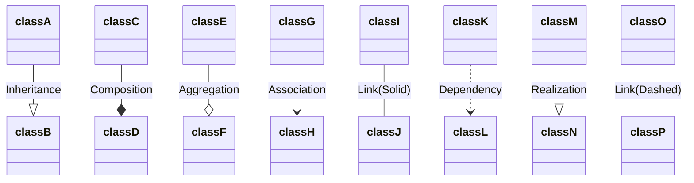
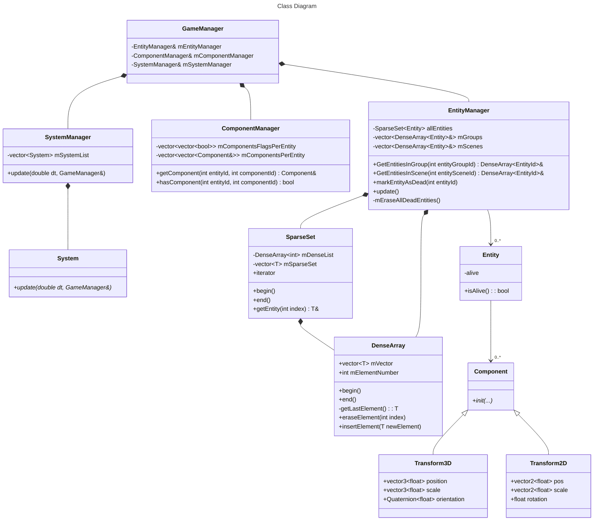

# **Estructura de la solución y proyectos (y repositorios de Git)**  {#estructura-de-la-solución-y-proyectos-(y-repositorios-de-git)}

# **Estructura de las clases**  {#estructura-de-las-clases}
Documentación de Mermaid para construir los gráficos: https://mermaid.js.org/syntax/classDiagram.html
---
## Leyenda de los diagramas:
### Clases, métodos y atributos
"*function() \: returnType*"

#### Prefijos:
- \+ Public
- \- Private
- \# Protected

#### Sufijos
- \$ Static
- \* Abstract (Cursiva)

### Relaciones:

---

##Clases Importantes

###EntityManager
- Contiene la lista (SparseSet) con todas las entidades vivas.
- Contiene los grupos y escenas. Estos solo son listas con los identificadores de las entidades que contienen
- Es el responsable de que todas las entidades que contiene sean validas. Para ello en su update, al inicio de cada bucle de juego recorrera todos los grupos y escenas eliminando de ellos las entidades marcadas como muertas. Después de esto y secuencialmente eliminará dichas entidades del SparseSet allEntities.
- Una vez haya eliminado todas las entidades muertas procederá a insertar en los grupos y escenas correspondientes a todas aquellas entidades que fueron creadas durante el anterior frame. Estas se almacenan en entitiesCreatedLastFrameQueue

###DenseArray
- Almacena un vector con capacidad de borrar y añadir elementos
- Al añadir el elemento se coloca el último en el vector
- Al eliminar un elemento, el último del vector se coloca en la posición del eliminado. Y después el número de elementos del vector se reduce en 1. El tamaño real del vector no se reduce, pero posteriormente al intentar acceder a un elemento guardado en un indice no inferior al número de elementos se lanzará un error
- Permiten recorrerlos con iteradores. Los iteradores tienen en cuenta el número de elementos para finalizar su recorrido
Para una mejor explicación ver: https://skypjack.github.io/2020-08-02-ecs-baf-part-9/

###Entity
- Su característica principal es un identificador único implicito. Este se corresponde con el indice que le corresponde a cada entidad en el DenseArray que las contiene. El indice que contienen los grupos y escenas que tienen a esta entidad en su interior es este mismo identificador
- Contiene un vector de componentes
- La index de cada componente en la lista se decide durante la precompilación
- Cada entidad solo puede tener anexado un componente de cada tipo.

###Component
- Contenedores de información anexables a una entidad
- Es una clase abstracta de la que heredaran los componentes reales del juego

# **Estructura de componentes del motor y juegos**  {#estructura-de-componentes-del-motor-y-juegos}

Arquitectura basada en:   
ECS:
**Componentes**: contienen datos.
**Sistemas**: contienen lógica. Se decide el orden de procesamiento de los sistemas. Y una única instancia de cada sistema (no pueden existir más) se ejecutará una vez por cada vuelta del bucle jugable. Los sistemas pueden acceder a las listas de todas las entidades con un mismo componente. Y obtener a partir de una entidad otros componentes de esta.

# **Pipeline de generación de contenido**  {#pipeline-de-generación-de-contenido}
