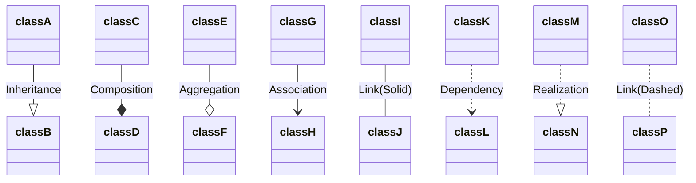

# **Estructura de la solución y proyectos (y repositorios de Git)** 

La compilación y generación de ejecutables de este proyecto estará controlada por un fichero "CMakeLists.txt".

## Interfaz de comunicación con el juego desde el motor
La clase principal del juego deberá heredar de la clase abstracta **MotorProgram**.
Esta clase definirá los metodos gameInit(), gameLoop() y gameEnd().
El motor llamará a estos métodos. Como se puede ver en el siguiente gráfico.

### ENGINE-GAME CONTROL FLOW 

```txt
        |------------------------------------------> Time
        |
Game    |    1----2    3----o----4    5----6
        |    |    |    |         |    |    |
        |----|----|----|---------|----|----|------->
        |    |    |    |         |    |    |
Engine  0----1    2----3      <--4----5    6-------x
        |
        |------------------------------------------>

0: Main
    CONTROL: Engine
    Engine Initialization.

1: Game Main
    CONTROL: Engine to Game
    Gameplay Initialization.
	Función Asociada: gameInit()

2: Engine Loop Start
    CONTROL: Game to Engine
    Stuff that needs to be done
    each frame before giving control
    back to game.

3: Game Loop Start
    CONTROL: Engine to Game
    Our game Gameplay Loop
    Includes doing things in/with
    SYSTEMS.
	Función Asociada: gameLoop()

4: Game Loop End
    CONTROL: Game to Engine
    The game loop update function
    is DONE.
    Engine may do stuff about the frame,
    for example, clear temporary data.
    Here if the game has not signaled
    that it wants to EXIT, control goes
    back to the Engine Loop Start (2).
    If the game has signaled EXIT,
    control goes to Engine Shutdown (5).

5: Game Shutdown
    CONTROL: Engine to Game
    The game is exiting.
    Do any game-specific shutdown stuff,
    like saving game data.
	Función Asociada: gameEnd()

6: Engine Shutdown
    CONTROL: Game to Engine
    The engine is exiting.
    Do any engine-specific shutdown stuff,
    like freeing engine resources.
```

## Uso de métodos del motor desde la clase de juego
Cada uno de los métodos anteriormente mencionados (gameInit(), gameLoop() y gameEnd()) recibirá como argumento un puntero o una referencia a un struct que contengan punteros a todas las funciones del motor que serán públicas. Esta estructura se llamará GameContext. De forma que desde las siguientes funciones se puede acceder a cualquiera de los métodos expuestos del motor con una sintaxis similar a esta: 
```cpp
gameContextRef->getEntitiesInGroup(X)
```

# **Estructura de las clases** 

Documentación de Mermaid para construir los gráficos: 
	https://mermaid.js.org/syntax/classDiagram.html
---
## Leyenda de los diagramas:
### Clases, métodos y atributos
"*function() \: returnType*"

#### Prefijos:
- \+ Public
- \- Private
- \# Protected

#### Sufijos
- \$ Static
- \* Abstract (Cursiva)

### Relaciones:

---


## RAII
Todas nuestras clases usarán la técnica de programación RAII: https://en.cppreference.com/w/cpp/language/raii.html.

### Aplicación de RAII
- Encapsular cada recurso en una clase, donde:
	- el constructor reserva el recurso y se asegura de instaurar todos los invariantes de representación o lanzar una excepción si esto es imposible
	- el destructor libera el recurso y nunca lanzará excepciones
- Siempre usar el recurso via una instancia de una clase que aplique RAII y que cumpla una de estas dos:
	- Tiene tiempo automatico de almacenamiento o tiempo de vida finito.
	- Tiene un tiempo de vida confinado por un objeto automático o de vida finita

Esto implica que aquellas clases que requieran reservar memoria para funcionar se ocuparan de liberarla automáticamente en su destrucción.
Es decir, el tiempo de vida de un recurso será menor o igual al tiempo de vida del objeto que lo contiene.

### Finalidad
El uso de RAII pretende conseguir:
- Que no haya memory leaks
- Que no pueda haber acceso a regiones de memoria sin inicializar o con basura

## Clases Importantes

### EntityManager
- Contiene la lista (SparseSet) con todas las entidades vivas.
- Todas las entidades que contiene serán siempre validas

### ComponentManager
- Contiene una lista por tipo de componente posible
- La misma posición de distintas listas de componentes serán componentes pertenecientes a la misma entidad. Esta posición además coincidirá con la posición de la entidad en la lista de entidades del EntityManager
- Las listas de componentes

### SparseSet y SparseDataSet
- Referencia https://skypjack.github.io/2020-08-02-ecs-baf-part-9/
- Contiene un set disperso, de índices; un set denso, de datos (componentes); y un set de backlinks, denso también, de igual tamaño que el de datos, que contiene los índices que se corresponden en el set disperso
- El tamaño que ocupa el set de datos solo se conoceré en runtime, es decir, guardará objetos de tipo desconocido. Pero en ejecución será capaz de devolver el objeto del tipo que realmente almacena.

### Components
- No heredarán de una clase base. Se recomienda que sean tan independientes como sea posible. Y que requieran el mínimo de información externa posible.
- Recomendable mantener la estructura y el alineamiento tan pequeño como se pueda.

### LogManager
- Todos los mensajes sacados por el motor o por el juego serán producidos por una instancia de esta clase
- Los mensajes serán reflejados en un fichero .log contenido en la carpeta logs del proyecto.
- Todos los mensajes impresos con esta clase llevarán hora, minutos y segundos desde que se inició el programa. Y se imprimirán en el orden en el que se hacen las llamadas al LogManager
- Usa la sintaxis del printf de c
- Se instancia al inicio con el motor, y se cierra con el motor
- Acceso al metodo print estatico de esta clase para que pueda escribir quien sea

## Funcionamiento Físicas
- Cuando hay colisión entre dos entidades se añade un componente (CollisionComponent) a cada una (si no lo tienen ya). En este componente hay un buffer de tamaño fijo que almacena los indices de los otros objetos contra los que se ha chocado en este frame. Al final de cada frame este componente se eliminará de todos los objetos que lo tengan
- A la hora de crear el juego se podrán consultar las colisiones de una entidad con getEntityCollisions(int entityId), que devolverá una lista de indices.
- Para que dos objetos puedan tener una colision detectada entre sí, ambos deben tener el componente Collider
  
# **Estructura de componentes del motor y juegos**

## Arquitectura Escogida: ECS
Usaremos como base para nuestra arquitectura el modelo Entity Componente System o ECS.

Esta arquitectura tiene 3 componentes básicos:
- **Entidades**: la entidad es la unidad minima de existencia de nuestro juego. Para que algo exista, se renderice o pueda tener parametros asociados habrá de ser una entidad. 
Las entidades no albergan ningún tipo de información en su interior. Pero cada una tiene asignado un identificador implicito gracias a su representación con un SparseSet como se explicará más adelante.
- **Componentes**: contienen unicamente datos serializables y públicos. Es decir, no podrán contener referencias ni punteros. En caso de necesitar un array de datos tendrán un buffer de tamaño constante autocontenido dentro del componente. 
No podrán tener lógica, ni requerir información de otras instancias del mismo componente o de otros distintos. La única manera en la que podrán contener funciones o métodos es cuando estos sean atómicos (se modifican a si mismos para conservar los invariantes de representación) u obtengan infomación implicita en el componente.
Su tamaño debería ser el menor posible.
Cada entidad solo puede tener asociado un componente de cada tipo
- **Sistemas**: contenedores de toda la lógica del juego. No podrán hacer llamadas a otros sistemas, pero si podrán obtener información así como modificarla de los componentes de cualquier entidad existente.

## Implementación
Usaremos extensivamente SparseSet para representar entidades, componentes y grupos de entidades.
### Estructura de Datos: SparseSet
- Referencia https://skypjack.github.io/2020-08-02-ecs-baf-part-9/
- Contiene un array disperso, de índices; un array denso, de datos(opcional); y un array de backlinks, denso también, de igual tamaño que el de datos, que contiene los índices que se corresponden en el array disperso
- El tamaño que ocupa el set de datos solo se conoceré en runtime, es decir, guardará objetos de tipo desconocido. Pero en ejecución será capaz de devolver el objeto del tipo que realmente almacena.

#### Características:
- iteración sobre todos los elementos en O(N)
- acceso aleatorio en O(1)
- inserción en O(1)
- borrado en O(1)

#### Objetivo:
Esta estructura a cambio de algo más de memoria nos permitirá mejorar el rendimiento.

Y nos facilitará la creación de varias características de nuestro motor. Como son las entidades, componentes, grupos y escenas.

Ser capaces de borrar entidades y componentes en tiempo de ejecución de forma sencilla e inmediata.

#### Implementación:
De forma que almacenaríamos nuestras entidades en una estructura de datos como la siguiente:
|					   |   |   |   |   |   |   |   |   |   |
|----------------------|---|---|---|---|---|---|---|---|---|
| Index Disperse Array (IdxDisperse) | - | 2 | - | 0 | - | 1 | - | - | - |
| Backlink Dense Array (BackDense) | 3 | 5 | 1 | - | - | - | - | - | - |


Cada elemento en la Index Disperse Array sería el indice de ese mismo elemento en la Backlink Dense Array y viceversa.
Es decir si miramos el indice 2 de la backlink array este contendrá el indice de la posición del indice de la Disperse array en el que podemos encontrar ese dos.
Por lo tanto se cumple el siguiente invariante de representación:
```cpp
	IdxDisperse[BackDense[i]] == i
	BackDense[IdxDisperse[i]] == i
```

En aquellos espacios en los que no haya un elemento habrá un valor específico, reservado para representar esto mismo. Indicado en las imagenes con "-"(guión).
##### Inserción en O(1)
Insertar en esta estructura es sencillo.  Simplemente añadiremos al final de la lista de backlinks un nuevo elemento. Para insertar le daremos un indice. Este indice hará referencia a la array dispersa. Nos aseguraremos de que no haya nada ya en esa posición y si es así lo añadiremos a la dispersa.
De forma que la array de antes quedaría así, tras añadir algo en la posición 8.
|					   |   |   |   |   |   |   |   |   |   |
|----------------------|---|---|---|---|---|---|---|---|---|
| Index Disperse Array (IdxDisperse) | - | 2 | - | 0 | - | 1 | - | - | 3 |
| Backlink Dense Array (BackDense) | 3 | 5 | 1 | 8 | - | - | - | - | - |
```cpp
	void insertar(int index){
		IdxDisperse[index] = BackDense.size();
		BackDense.push_back(index);
	}
```

##### Eliminación en O(1)
La eliminación en esta estructura es también sencilla aunque no lo parezca a simple vista.
Eliminaremos elementos también por indice. Dando una configuración no válida al elemento en la Index Disperse Array. E intercambiando el último elemento de la backlink con aquel que queremos eliminar. Habrá que actualizar el valor del index disperse array de aquel que hemos movido. Y habríamos concluido la eliminación.
Por ejemplo para eliminar el elemento con indice 5 del anterior SparseSet quedaría así:
|					   |   |   |   |   |   |   |   |   |   |
|----------------------|---|---|---|---|---|---|---|---|---|
| Index Disperse Array (IdxDisperse) | - | 2 | - | 0 | - | - | - | - | 1 |
| Backlink Dense Array (BackDense) | 3 | 8 | 1 | - | - | - | - | - | - |
```cpp
	void eliminar(int index){
		//back devuelve el último elemento válido del array
		BackDense[IdxDisperse[index]] = BackDense.back();
		IdxDisperse[BackDense.back()] = IdxDisperse[index];
		BackDense.pop_back();
		IdxDisperse[index] = NON_VALID_VALUE;
	}
```

Al llamar a eliminar con un indice que no tiene elemento asignado la operación fallará y no hará nada. Pero no producira un error.

##### Iteración de todos sus elementos en O(N)
Para esto simplemente habremos de recorrer el array de backlinks denso desde el primer elemento hasta el último.

##### Añadiendo Datos:
De momento solo estamos guardando indices en ambos arrays. Sin duda esto nos será útil para las entidades, grupos y escenas. Pero para los componentes queremos poder guardar su información y poder acceder a ella de forma eficiente. Para esto añadiremos un tercer array que almacenará los datos necesarios.

Este tercer vector será también denso e imitará el comportamiento del vector denso de Backlinks.
Es decir el elemento i de la lista de backlinks corresponde con la información guardada en el indice i del array de información.

|					   |   |   |   |   |   |   |   |   |   |
|----------------------|---|---|---|---|---|---|---|---|---|
| Index Disperse Array | - | 2 | - | 0 | - | 1 | - | - | - |
| Backlink Dense Array | 3 | 5 | 1 | - | - | - | - | - | - |
| Data Dense Array 	   | Info_3 | Info_5 | Info_1 | - | - | - | - | - | - |

### Uso de SparseSet para Entidades y Componentes:
Para hacer que buscar entidades con un mismo componente así como poder recorrer todas las entidades usaremos un SparseSet base para todas las entidades y uno por componente.

El **identificador** de cada <u>entidad</u> será el **indice** que ocupen en el <u>Index Disperse Array</u>

Los <u>componentes</u> que ocupen el **indice i** de su <u>array sparse</u> correspondiente serán componentes asociados a la entidad con **identificador i**

De forma que los sparseSet de entidades y componentes estan entrelazados de forma implicita.

#### Añadir Entidades
Para añadir una entidad la añadiremos al SparseSet de entidades.

#### Añadir Componentes
Para añadir un componente necesitamos el id de la entidad a la que queremos añadirselo.
De forma que haremos la operación insertar con el indice de dicha entidad en el SparseSet de ese tipo de componente.

#### Eliminar Componentes
Para eliminar un componente volvemos a necesitar el id de la entidad a la que queremos quitarselo.
Después simplemente haremos la operación eliminar con el indice de dicha entidad en el SparSet de ese tipo de componente.

#### Eliminar una Entidad
Para eliminar una entidad primero usaremos el indice de la entidad para eliminarla en todas los SparseSet de componentes que la contengan.
Después, la eliminaremos de la lista de entidades. 

### Grupos y escenas
Tanto los grupos como escenas serán meramente vectores con los identificadores de los objetos que contienen.

Podemos volver a usar la estructura SparseSet y modelarlos igual que componentes sin información (sin array adicional de datos o cuya suma del espacio en memoria de sus elementos es 0).

Aunque crearemos un capa de abstracción para que conceptualmente sean algo distinto.

### Ejemplo completo
|					   |   |   |   |   |   |   |   |   |   |
|----------------------|---|---|---|---|---|---|---|---|---|
|**Entity SparseSet**|***|***|***|***|***|***|***|***|***|
| Index Disperse Array | - | 2 | - | 0 | - | 1 | - | - | 3 |
| Backlink Dense Array | 3 | 5 | 1 | 8 | - | - | - | - | - |
|**Component A SparseSet**|***|***|***|***|***|***|***|***|***|
| Index Disperse Array | - | 2 | - | 1 | - | 0 | - | - | - |
| Backlink Dense Array | 5 | 3 | 1 | - | - | - | - | - | - |
| Data Dense Array 	   | Info_5 | Info_3 | Info_1 | - | - | - | - | - | - |
|**Component B SparseSet**|***|***|***|***|***|***|***|***|***|
| Index Disperse Array | - | 0 | - | - | - | - | - | - | 1 |
| Backlink Dense Array | 1 | 8 | - | - | - | - | - | - | - |
| Data Dense Array 	   | Info_1 | Info_8| - | - | - | - | - | - | - |
|**Group A SparseSet (In reality Component C)**|***|***|***|***|***|***|***|***|***|
| Index Disperse Array | - | - | - | 0 | - | 1 | - | - | 2 |
| Backlink Dense Array | 3 | 5 | 8 | - | - | - | - | - | - |
|**Scene A SparseSet (In reality Component D)**|***|***|***|***|***|***|***|***|***|
| Index Disperse Array | - | 2 | - | 1 | - | 0 | - | - | 3 |
| Backlink Dense Array | 5 | 3 | 1 | 8 | - | - | - | - | - |

# **Pipeline de generación de contenido** 
