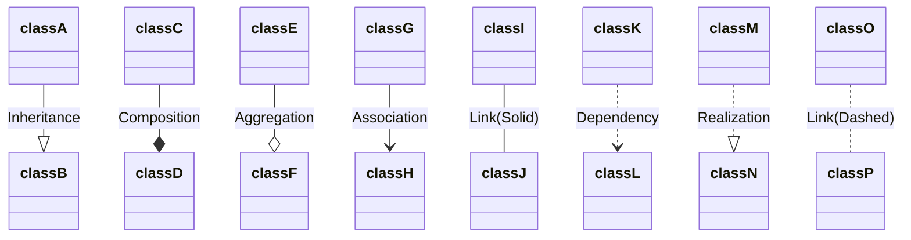
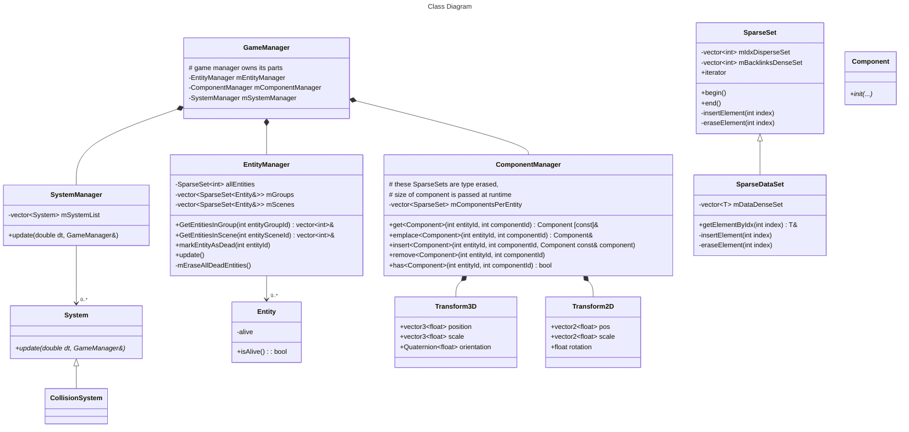

# **Estructura de la solución y proyectos (y repositorios de Git)** 

### ENGINE-GAME CONTROL FLOW 

```txt
        |------------------------------------------> Time
        |
Game    |    1----2    3----o----4    5----6
        |    |    |    |         |    |    |
        |----|----|----|---------|----|----|------->
        |    |    |    |         |    |    |
Engine  0----1    2----3      <--4----5    6-------x
        |
        |------------------------------------------>

0: Main
    CONTROL: Engine
    Engine Initialization.

1: Game Main
    CONTROL: Engine to Game
    Gameplay Initialization.

2: Engine Loop Start
    CONTROL: Game to Engine
    Stuff that needs to be done
    each frame before giving control
    back to game.

3: Game Loop Start
    CONTROL: Engine to Game
    Our game Gameplay Loop
    Includes doing things in/with
    SYSTEMS.

4: Game Loop End
    CONTROL: Game to Engine
    The game loop update function
    is DONE.
    Engine may do stuff about the frame,
    for example, clear temporary data.
    Here if the game has not signaled
    that it wants to EXIT, control goes
    back to the Engine Loop Start (2).
    If the game has signaled EXIT,
    control goes to Engine Shutdown (5).

5: Game Shutdown
    CONTROL: Engine to Game
    The game is exiting.
    Do any game-specific shutdown stuff,
    like saving game data.

6: Engine Shutdown
    CONTROL: Game to Engine
    The engine is exiting.
    Do any engine-specific shutdown stuff,
    like freeing engine resources.
```

# **Estructura de las clases** 
Documentación de Mermaid para construir los gráficos: https://mermaid.js.org/syntax/classDiagram.html
---
## Leyenda de los diagramas:
### Clases, métodos y atributos
"*function() \: returnType*"

#### Prefijos:
- \+ Public
- \- Private
- \# Protected

#### Sufijos
- \$ Static
- \* Abstract (Cursiva)

### Relaciones:

---



## Clases Importantes

### EntityManager
- Contiene la lista (SparseSet) con todas las entidades vivas.
- Contiene los grupos y escenas. Estos solo son listas con los identificadores de las entidades que contienen
- Es el responsable de que todas las entidades que contiene sean validas. Para ello en su update, al inicio de cada bucle de juego recorrera todos los grupos y escenas eliminando de ellos las entidades marcadas como muertas. Después de esto y secuencialmente eliminará dichas entidades del SparseSet allEntities.
- Una vez haya eliminado todas las entidades muertas procederá a insertar en los grupos y escenas correspondientes a todas aquellas entidades que fueron creadas durante el anterior frame. Estas se almacenan en entitiesCreatedLastFrameQueue

### SparseSet
- Referencia https://skypjack.github.io/2020-08-02-ecs-baf-part-9/
- Contiene un set disperso, de índices; un set denso, de datos (componentes); y un set de backlinks, denso también, de igual tamaño que el de datos, que contiene los índices que se corresponden en el set disperso
- Tiene una sobrecarga específica con ningún tipo, que evita que se guarde el set de datos

### Entity
- Su característica principal es un identificador único implicito. Este se corresponde con el indice que le corresponde a cada entidad en el DenseArray que las contiene. El indice que contienen los grupos y escenas que tienen a esta entidad en su interior es este mismo identificador
- Contiene un vector de componentes
- La index de cada componente en la lista se decide durante la precompilación
- Cada entidad solo puede tener anexado un componente de cada tipo.

### Components
- They need not to follow any inheritance constraint. Other than it is heavily encouraged to be as dependent on as few other external data as possible. 
- It is reccomended to keep structure size and alignment as small as possible.

# **Estructura de componentes del motor y juegos**

Arquitectura basada en:   
ECS:
**Componentes**: contienen datos.
**Sistemas**: contienen lógica. Se decide el orden de procesamiento de los sistemas. Y una única instancia de cada sistema (no pueden existir más) se ejecutará una vez por cada vuelta del bucle jugable. Los sistemas pueden acceder a las listas de todas las entidades con un mismo componente. Y obtener a partir de una entidad otros componentes de esta.

# **Pipeline de generación de contenido** 
