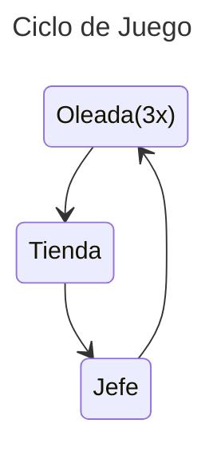

# Angry Balls

---
# *Documento de diseño del juego*
### Equipo de desarrollo: 

**Integrantes:**  
- Paula Alemany Rodríguez
- Óscar Melquiades Durán Narganes 
- Denisa Juarranz Berindea  
- José Narciso Robles Durán
- Izan de Vega López   
- David Palacios Daza
- Amiel Ramos Juez  
- Álvaro Piña Sánchez-Sierra
- Hugo de Brito Rocha

## ÍNDICE  
1. [Resumen](#1-resumen)  
   1.1. [Descripción](#11-descripción)  
   1.2. [Género](#12-género)  
   1.3. [Público objetivo](#13-público-objetivo)  
   1.4. [Ambientación y tono](#14-Ambientación-y-tono)  
   1.5. [Características principales](#15-características-principales)  

2. [Jugabilidad](#2-Jugabilidad)  
   2.1. [Objetivo del juego](#21-objetivo-del-juego)  
   2.2. [Ciclo de juego](#22-Ciclo-de-juego)  

3. [Mecánicas](#3-mecánicas)  
   3.1. [Movimiento](#31-Movimiento)  

4. [Interfaz](#4-interfaz)  
   4.1. [Controles](#41-controles)  
   4.2. [Cámara](#42-cámara)  
   4.3. [HUD](#43-hud)  
   4.4. [Menús](#44-menús)  

5. [Mundo del juego](#5-mundo-del-juego)  
   5.1. [Personajes](#51-personajes)  
   5.2. [Niveles](#52-niveles)  

6. [Experiencia de juego](#6-experiencia-de-juego)  

7. [Estética](#7-estética)  

8. [Referencias](#8-referencias)

## 1. Resumen  

### 1.1. Descripción  
En este juego, juegas desde el punto de vista (FPS) de un caza demonios que busca capturar todos los AngryBalls posibles. Los "Angryballs" son la puntuación, fragmentos de alma: cada demonio derrotado es convertido en "AngryBalls", y cuanto más fuerte el enemigo más puntuación te dará. Para ello, destroza a los enemigos con tu ametralladora y trata de evitar que te maten durante la mayor cantidad de oleadas. En tu jornada, tendrás desafíos cada vez mayores. Contarás con la ayuda de una entidad carismática que te pide las "AngryBalls" en cambio de ventajas y también de "HappyBalls" (ventajas momentáneas en una oleada).
Gestiona tus recursos y compra mejoras para lograr más puntos.

### 1.2. Género  
Fast-paced FPS Arcade

### 1.3. Público objetivo
Adolescente y jovén adulto

### 1.4. Ambientación y tono  
La acción se desarrolla en diferentes espacios abiertos, pero delimitados, como una plaza de una ciudad desolada o un terreno baldío entre tierras. 
Se busca un tono oscuro que mezcle un mundo desértico con los demonios a los que hay que capturar.

### 1.5. Características principales  
*Ritmo rápido*
   - Movimiento fluido
   - Muchos enemigos
   - Muchas balas
   - Feedback sonoro y visual
   - Intensidad alta

*Supervivencia infinita*
   - Oleadas progresivas en dificultad
   - La dificultad de las oleadas se mide con los siguientes parámetros:
   -    numEnemies(wave): El número de enemigos por oleada
   -    killPoints(wave): Cantidad de puntos que otorgan los enemigos en esa oleada
     
*Rejugable*
   - Tienda: Gestión de recursos
   - Búsqueda de la mejor puntuación
   - Mejora de las habilidades del jugador en las mecánicas
   - Mejora de las habilidades del jugador en la estrategia

## 2. Jugabilidad  
Consiste en una vista en primera persona con una mirilla para apuntar y disparar. Hay que moverse por el escenario para matar a los enemigos disparándoles y evitar que te peguen.
Cuando termina una oleada empezará la siguiente, habiendo en determinados momentos oleadas especiales de más calma o de más tensión (Momentos de comprar y momentos de batallas contra minijefes)

### 2.1. Objetivo del juego   
Conseguir la mayor cantidad de AngryBalls posibles.

### 2.2. Ciclo de juego

Una partida tendrá el siguiente ciclo que se repite infinitamente:
1. Oleada estándar 1
2. Oleada estándar 2
3. Oleada estándar 3
4. Tienda
5. Oleada jefe

El ciclo termina si el jugador muere.

*Oleada estándar:*
Oleada compuesta por enemigos normales. Incrementarán su dificultad de forma lineal teniendo en cuenta el número de oleada.

*Tienda:*
Una entidad con mucha personalidad surgirá en el mapa para ofrecer un contrato. Aparece aleatoriamente entre oleadas (Minimo cada 3 oleadas máximo cada 7) y permite comprar vidas a cambio de Angryballs. 
No tiene enemigos y permite cambiar las tornas de la partida.
El jugador debe gestionar si le compensa más perder parte de su puntuación para conseguir vidas extras o continuar con los recursos que tiene en ese momento.
El jugador puede tener como máximo 3 vidas a la vez.
La tienda también permite comprar ventajas como mejoras de arma.
Contexto y lore pueden venir del diálogo con este personaje.

*Jefe:*
La oleada de jefe aparecerá cada 3 oleadas y tendrá una dificultad ligeramente mayor a las oleadas anteriores por tener un enemigo especial de tipo jefe además de enemigos estándar.
Más información de los enemigos en el apartado enemigos.

## 3. Mecánicas  

### 3.1. Movimiento

**Parámetros:**  
-  Posición (x, y, z) (z solo para enemigos voladores)
-  Velocidad (x, y, z) (z solo para enemigos voladores)
El jugador y los enemigos podrán moverse por el entorno con libertad dentro de los límites del mapa. 

### 3.2. Disparo

**Parámetros:**  
-  Posición (x, y)
-  Cadencia
-  Velocidad de proyectil
-  Orientación en los 3 grados de libertad
-  Origen (Si es un disparo enemigo o del jugador)
Si un proyectil enemigo colisiona con el jugador le quitará una vida y lo mismo sucederá a la inversa con las balas del jugador y los enemigos.

El jugador podrá disparar 2 tipos diferentes de balas:
- Munición normal: munición que se va agotando y hay que ir recogiendo.
- AngryBalls: Hacen el doble de daño que las balas normales pero pierdes la puntuación que vas gastando.

Las balas solo se destruirán cuando chocan contra una cobertura o cuando salen del mapa, matarán a todos los enemigos de la fila.

## 4. Interfaz  

El botón seleccionado se simboliza con un resaltado amarillo en el texto y una AngryBall a su izquierda.
Todas las imagenes son conceptuales y orientativas, no el diseño definitivo para el juego.

### 4.1. Controles  
- Movimiento: WASD.
- Disparo balas normales: click izquierdo del ratón.
- Disparo de angryballs: click derecho del ratón.
- Uso de objeto: E.

### 4.2. Cámara  
La cámara es en primera persona y se moverá con el ratón. Siempre se dispara en la dirección del centro de la cámara.

### 4.3. HUD  

Muestra los angryballs del jugador en la esquina superior izquierda.
Tanto la vida del jugador como la munición se muestra en la esquina inferior derecha.
El número de oleada actual se muestra en la esquina superior derecha.
Si el jugador tiene algún objeto a utilizar se mostrará en la esquina inferior izquierda. 

### 4.4. Menús  
- **Menú principal**
    - Jugar.
    - Salir.
    - Estadísticas.
      

- **Menú de Fin de Juego**
    - Menú principal.
    - Salir del Juego.
      

- **Menú de Tienda**
    - Vidas, mejoras y sus precios
    - Estado del jugador (Vida actual y munición restante)
    - Numero de angryballs

      Se coloca sobre la pantalla de juego pero bajo el HUD.

- **Menú de Estadísticas**
  Muestra las siguientes estadísticas del jugador:
  - Máxima puntuación conseguida (Angryballs)
  - Máxima oleada que se ha alcanzado
  - Enemigos simples matados
  - Jefes derrotados
    

## 5. Mundo del juego  

### 5.1. Personajes  
- **Jugador:** 
  //imagenes
  

  El jugador tendrá los diferentes parámetros:
  - Vida: Al comenzar tendrá 3 vidas, por cada golpe pierde 1 vida y estas podrán recuperarse en la tienda.
  - Munición: Balas que tiene el jugador, cuando llegue a 0 no podrá disparar más.
  - Velocidad: Velocidad de movimiento del jugador.

- **Enemigos:**

	Los enemigos tendrán los siguientes parámetros:
	- Vida: Cuando esta llegue a 0 se eliminarán
	- Angryballs: Numero de angryballs que da al jugador al morir.
	- Daño: Daño que hacen los enemigos al golpear al jugador.

	**Características**
	Estándar:
	 - Terrestres: 
		-movimiento: camina por el suelo hacia el jugador.
		-ataque: puede disparar proyectiles. El contacto directo con este enemigo le quita una vida al jugador.
	 - Voladores:
		-vuela con fluctuaciones de altura (z) y va hacia el jugador.
		-ataque: cuerpo a cuerpo. El contacto directo con este enemigo le quita una vida al jugador.
	Jefe: 
	- en el medio del mapa, estático, dispara proyectiles en todas las direcciones
	- genera enemigos estándar

	**Modificadores en función de la oleada**
    Enemigos estándar:
	- (+) vida - más daño para morir
	- (+) velocidad - van a por el jugador más rápidamente
	- (-) tamaño - más difícil de acertar
    Jefes:
	- (+) vida - más daño para morir
	- (-) tamaño - más difícil de acertar

### 5.2. Niveles 
**Oleada normal:**
- Mapa de tamaño delimitado que puede disminuir, aumentando la dificultad, conforme avanzan las oleadas.
**Oleada jefe:**
- Mapa distinto del de oleada normal. Tiene coberturas no traspasables por ningún objeto o entidad que permiten evitar ataque de proyectiles del Jefe o de enemigos estándar.

### 5.3. Objetos del mundo 
- **Coberturas:**
   Existen dos tipos de cobertura: la cobertura completa y la cobertura parcial.
   **Cobertura completa:** Las balas de los enemigos no podrán darte de ninguna manera.
   **Cobertura parcial:** Existe un 50% de probabilidad de que la bala golpeé la cobertura o la sobrepase.
   Estas aparecerán unicamente en las oleadas de jefes y permitirá cubrirse de sus proyectiles.
  
- **Objetos (o "HappyBalls"):**
   Al matar a enemigos estos pueden soltarte un objeto, teniendo cada tipo de objeto una probabilidad distinta de aparecer. Los objetos pueden ser:
  - Vida: Recupera una vida, se coge automaticamente no se almacena para usarse. Probabilidad de aparición 5%.
  - Mejora de velocidad: Aumenta en un 25% la velocidad del personaje durante la oleada. Probabilidad de aparición 20%.
  - Munición: Da 20 balas extra, se coge automaticamente este objeto no se almacena para usarse. Probabilidad de aparición del 65%.
  - Munición infinita: Da duración infinita durante 5 min. Probabilidad de aparición 10%.

  El jugador solo podrá mantener un objeto a la vez, si pasa por un objeto diferente este se sustituirá por el que tenía guardado.
  Los objetos permanecerán en el suelo 1 min, si no se recogen pasado ese tiempo desaparecerán.
  Se llaman "HappyBalls", porque este mundo no es maniqueísta y hasta los demonios pueden tener algo de bueno que lo dejan al morir.

## 6. Experiencia de juego  
**Dinámicas Buscadas**
Se busca que el jugador utilice los objetos en los momentos más eficientes. Que el jugador cree una estrategia y gestione los recursos de manera que consiga la mejor puntuación posible al final.
Que el jugador decida cuando disparar y hacia donde para amortizar las balas de la mejor manera posible. Se busca también que el jugador se mueva por el mapa en general recogiendo los diferentes objetos y matando a los diferentes enemigos.

Para que la dificultad del juego vaya en aumento por oleada se incrementarán los siguientes parámetros:
- NumEnemigos: Numero de enemigos por oleada.
     - Vida: Aumentará la vida de los enemigos.
     - Angryballs: Aumentarán las angryballs que sueltan los enemigos.

**Descripción de Partida**
Entras a La Torre y te encuentras una sala, matas a todos los enemigos (mientras puedes ir buscando cofres por la sala), al matarlos a todos se desbloquen las escaleras y aparece un mini jefe opcional, puedes o pasar de nivel o enfrentarte a él por más angryballs. En la sala final se encontrará un jefe al que se debe derrotar para finalizar el nivel.

Cuando el jugador es golpeado tendrá 10s de inmunidad para poder moverse y alejarse.

## 7. Estética 

**Estética:**
- Música 
- SFX 
- Paleta de colores //Ahora mismo no se poner una imagen pero tengo la paleta

## 8. Referencias  
- Devil Daggers 
- Doom
- Crossbow: Bloodnight 
- Devil May Cry 
- Bloodborne 
- Hades
