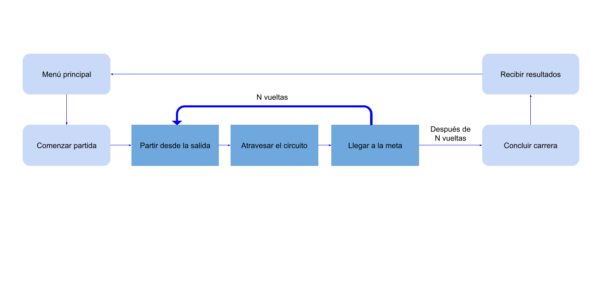
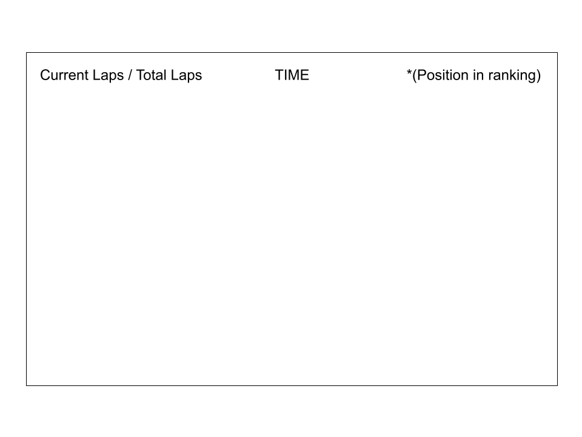
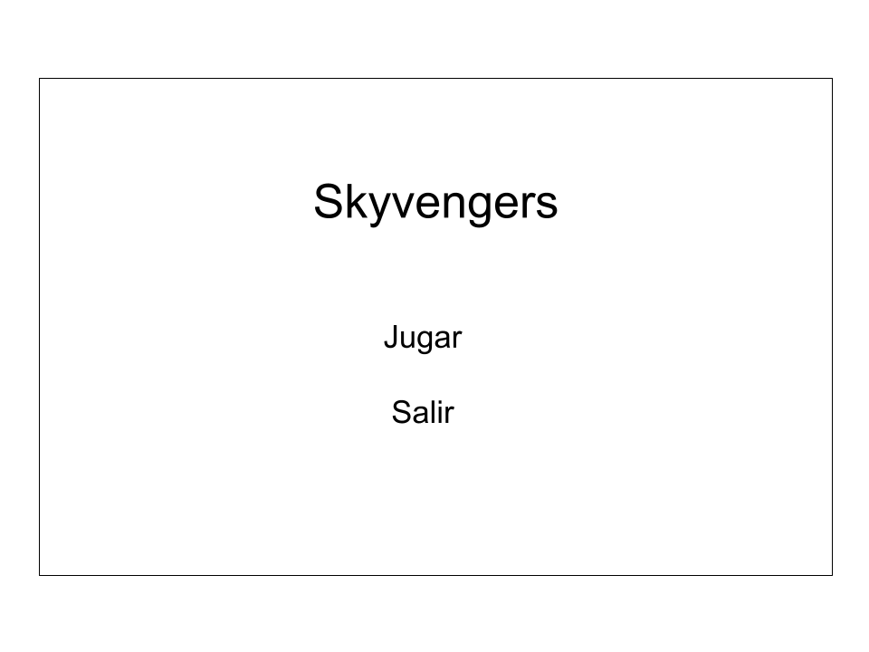
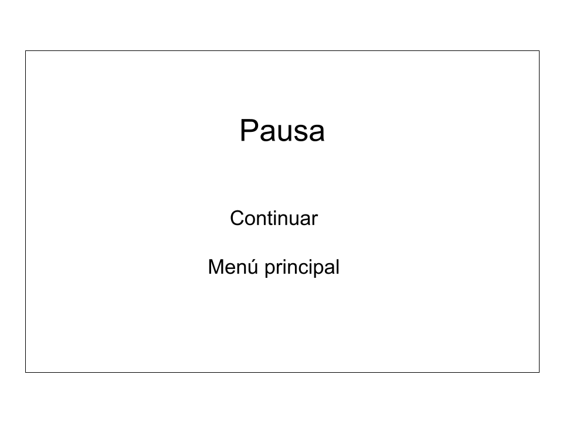
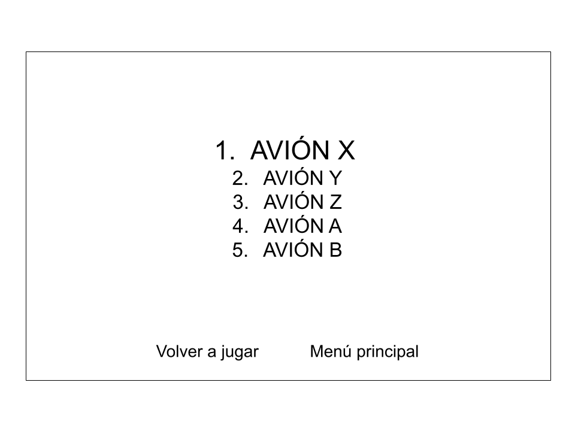
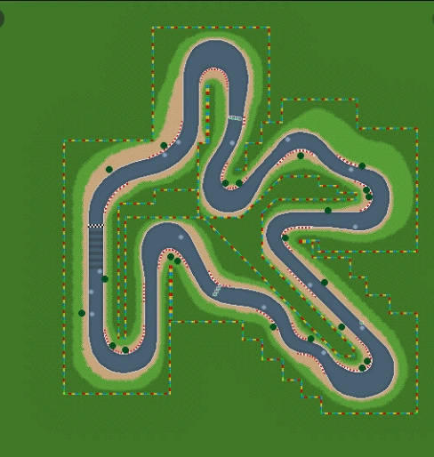
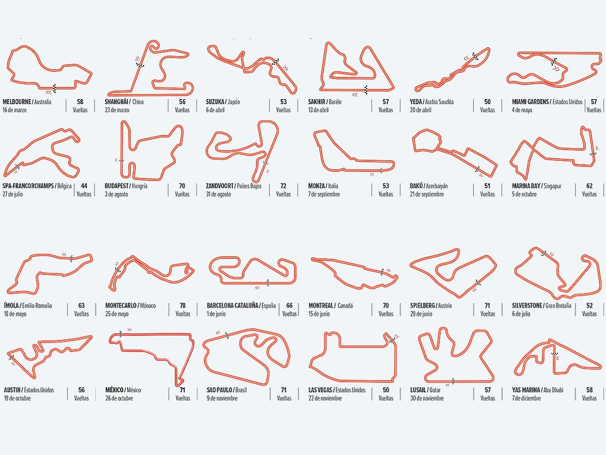

# Skyvengers
***Subtítulo Página Web*** 🌐 **[Página web del juego](https://www.youtube.com/watch?v=dQw4w9WgXcQ)**  

---
# *Game Design Document*
### Equipo de desarrollo: 

**Integrantes:**  
- Paula Alemany Rodríguez
- Óscar Melquiades Durán Narganes 
- Denisa Juarranz Berindea  
- José Narciso Robles Durán
- Izan de Vega López   
- David Palacios Daza
- Amiel Ramos Juez  
- Álvaro Piña Sánchez-Sierra
- Hugo de Brito Rocha

## ÍNDICE  
1. [Resumen](#1-resumen)  
   1.1. [Descripción](#11-descripción)  
   1.2. [Género](#12-género)  
   1.3. [Público objetivo](#13-público-objetivo)  
   1.4. [Ambientación y tono](#14-ambientación-y-tono)  
   1.5. [Características principales](#15-características-principales)  

2. [Gameplay](#2-gameplay)  
   2.1. [Objetivo del juego](#21-objetivo-del-juego)  
   2.2. [Ciclo de juego](#22-ciclo-de-juego)  

3. [Mecánicas](#3-mecánicas)  
   3.1. [Movimiento](#31-movimiento)  
   3.2. [Colisiones](#32-colisiones)  

4. [Interfaz](#4-interfaz)  
   4.1. [Controles](#41-controles)  
   4.2. [Cámara](#42-cámara)  
   4.3. [HUD](#43-hud)  
   4.4. [Menús](#44-menús)  

5. [Mundo del juego](#5-mundo-del-juego)  
   5.1. [Personajes](#51-personajes)  
   5.2. [Niveles](#52-niveles)  

6. [Experiencia de juego](#6-experiencia-de-juego)  

7. [Estética y contenido](#7-estética-y-contenido)  

8. [Referencias](#8-referencias)  

9. [Testing](#9-testing)  
   9.1. [Plan de Pruebas](#91-plan-de-pruebas)  
   9.2. [Conclusiones](#92-conclusiones)  

## 1. Resumen  

### 1.1. Descripción  
Juego de carreras de aviones en el que el jugador compite contra pilotos controlados por inteligencia artificial con el objetivo de completar un número determinado de vueltas en el menor tiempo posible.

### 1.2. Género  
Carreras

### 1.3. Público objetivo
Cualquier persona que disfrute que los juegos de carreras

### 1.4. Ambientación y tono
Circuitos pequeños y cerrados en entornos estilizados, combinando zonas abiertas con secciones de alta densidad de giros y obstáculos dificultarán el paso.  

### 1.5. Características principales  
- Un jugador
- Colisiones con el entorno
- Aceleración gradual hasta un límite

## 2. Gameplay  

### 2.1. Objetivo del juego   
Completar un número determinado de vueltas antes que los contrincantes. Para ello, el jugador debe atravesar todo el circuito y pasar la línea de salida y meta tantas veces como vueltas haya.

### 2.2. Ciclo de juego

1. Menú principal
2. Comenzar carrera
3. Partir desde la salida
4. Atravesar el circuito
5. Llegar a la meta
6. Si el número de vueltas completadas es igual al número de vueltas requerido, continuar. De lo contrario, volver al paso 3.
7. Concluir carrera
8. Recibir resultados
9. Volver al paso 1

- El bucle será interrumpido en el caso de que el jugador quiera salir del juego, independientemente de su estado actual.

## 3. Mecánicas  

### 3.1. Movimiento
Cada avión se propulsará hacia delante automáticamente, acumulando velocidad sin necesitar ninguna intervención por parte del jugador. Este únicamente será capaz de rotar y modificar la altura de su propio avión dentro de unos límites verticales y horizontales, cambiando la dirección en la que se propulsa continuamente.

### 3.2. Colisiones
En el caso de chocarse contra un obstáculo o una pared, el avión será frenado a 0 y deberá acumular velocidad de nuevo.

En caso de chocarse contra otro avión, ambos se frenarán y deberán acumular la velocidad de nuevo.

## 4. Interfaz  

### 4.1. Controles  
- Movimiento: WASD / LS.  

### 4.2. Cámara  
-	Cámara en tercera persona
-	Fija detrás del avión
-	Leve lerp para aparentar movimiento, siguiendo el movimiento del avión

### 4.3. HUD  
La interfaz del juego mostrará tres elementos de interés: 
- El número de vueltas actual del jugador.
- El número de vueltas total.
- El tiempo total transcurrido.
- (Opcional) Su posición en el ranking.

### 4.4. Menús  
- **Menú principal**
   - Jugar.
   - Salir.

- **Menú de pausa**
   - Continuar.
   - Menú principal.

- **Menú de fin de Juego**
   - Ranking
   - Volver a jugar.
   - Menú principal.

## 5. Mundo del juego  

### 5.1. Personajes  
- **Jugador:** 
Aviones con diferente gama cromática.

  //imágenes próximamente

- **Enemigos:**
Aviones con diferente gama cromática.

  //imágenes próximamente

### 5.2. Niveles  
Circuitos cerrados, con obstáculos y diferentes caminos a superar. Como inspiración tomaremos los circuitos de la saga Mario Kart y de la Fórmula 1.

## 6. Experiencia de juego  
**Dinámicas Buscadas**
- Aceleración gradual y rápida
- Pruebas de habilidad puntuales
- Decisiones rápidas
- Tensión continua

**Descripción de Partida**
Los aviones comienzan cada carrera desde la línea de salida y meta. A lo largo de cada vuelta, tanto el jugador como los aviones controlados por IA deben tomar varios giros con suficiente velocidad para no quedarse atrás; pero al mismo tiempo con cuidado de no chocarse con los bordes. Cuando el jugador pasa la línea de meta, el contador de vueltas aumenta, finalmente concluyendo la carrera una vez se hayan completado todas las vueltas requeridas. Cuando se dé este evento, el jugador será calificado en función de su posición final, tras lo que puede volver al menú principal y comenzar otra carrera.

## 7. Estética y contenido  
**Estética:**
-	Estilo low poly
-	Paleta de colores contrastada
-	Música dinámica
-	SFX para colisiones
-	SFX para derrota
-	SFX para victoria
-	SFX para selección de botones

**Contenido:**  
- Varios circuitos generados en archivos de Lua
 
## 8. Referencias  
- Later Skater - Minijuego de Mario Party 5 (2003)
- Star Fox (1993, Super Nintendo)
- Race the Sun (2013)
- Wii Sports Resort (2009), los juegos relacionados a Vuelo Turístico y Combate en Vuelo
- Avicii Gravity HD (2013)
- Alan Walker – The Aviation Game (2019)
- Saga Mario Kart (Nintendo)
- Fórmula 1

##  9. Testing

### 9.1. Plan de pruebas  
**Próximamente**  

### 9.2. Conclusiones
**Próximamente**  